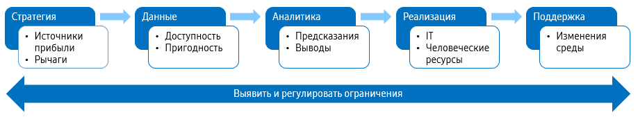
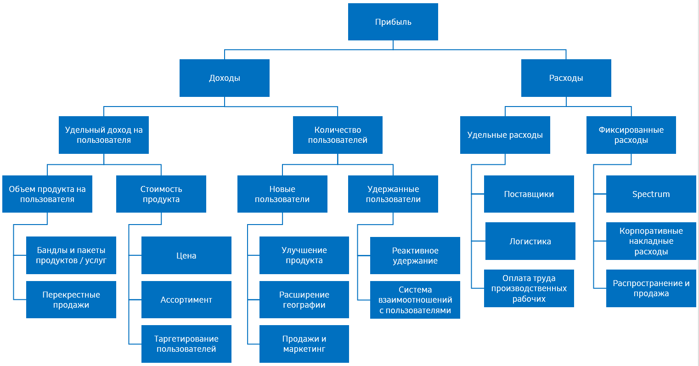

# data-project-checklist

*Перевод статьи Джереми Ховарда [Data project checklist](https://www.fast.ai/2020/01/07/data-questionnaire/) (версия от 07.01.2020).*

Как обсуждалось в книге [Designing Great Data Products](https://www.oreilly.com/radar/drivetrain-approach-data-products/), 
для того, чтобы проект, использующий большие данные, приносил реальную пользу, мало просто обучить модель с высокой точностью. 
Когда я занимался консалтингом в этой сфере, я всегда старался понять контекст, 
в котором организация работает с данными, исходя из следующих соображений:

* *Стратегия*: Что организация пытается сделать (*цель*) и что она может изменить, чтобы добиться большего (*рычаги*)?
* *Данные*: Собирает ли организация необходимые для этого данные и предоставляет ли к ним доступ?
* *Аналитика*: Ответы на какие вопросы были бы полезны организации?
* *Реализация*: Какие у организации есть возможности реализации?
* *Поддержка*: Какие системы существуют для отслеживания изменений в операционной среде?
* *Ограничения*: Какие ограничения нужно учитывать в каждой из вышеперечисленных областей?

Я придумал опросник и просил клиентов его заполнить перед началом проекта, а потом помогал доработать ответы на всех этапах.
Этот опросник является результатом многолетней работы над проектами в разных отраслях, включая сельское хозяйство, 
горное дело, банковскую деятельность, пивоварение, телекоммуникации, розничную торговлю и т.д. Я делюсь им здесь впервые.

## Организационные вопросы

### Специалисты по данным

У специалистов по данным должен быть четкий карьерный путь с возможностью стать руководителями высшего звена.
Также должны быть разработаны планы найма, позволяющие напрямую привлекать экспертов по данным на руководящие должности. 
Если деятельность организации в основном связана с работой с данными, специалисты по данным должны быть одними из самых высокооплачиваемых сотрудников. 
Должны существовать процессы, позволяющие специалистам по данным из разных команд сотрудничать и учиться друг у друга.

* Какие навыки работы с данными есть сейчас у специалистов организации?
* Как происходит найм специалистов по данным?
* Как в организации можно выявить специалистов, обладающих навыками работы с данными?
* Какие навыки ищет и ценит организация? Как они оцениваются? Почему именно они считаются важными?
* Пользуется ли организация услугами консалтинга в проектах с данными? Какого рода консалтинг используется? 
В каких ситуациях анализ данных передается на аутсорсинг? Как результаты передаются организации?
* Сколько платят специалистам по данным? Кому они подчиняются? Как развиваются их профессиональные навыки?
* Каков карьерный путь специалистов по данным в организации?
* Сколько руководителей имеют большой опыт в области анализа данных?
* Как отбираются и распределяются задачи для специалистов по данным?
* Какое железо и программное обеспечение есть у специалистов по данным?

### Стратегия

Все проекты с большими данными должны решать стратегически важные задачи. 
Следовательно, в первую очередь нужно понять бизнес-стратегию организации.

* Какие 5 наиболее важных стратегических проблем в организации сегодня?
* Какие данные доступны для решения этих проблем?
* Используется ли для решения этих проблем анализ данных? Работают ли над этим специалисты по данным?
* На какие факторы роста прибыли организация может наиболее сильно повлиять?

* Для каждого из наиболее важных факторов роста прибыли, перечисленных выше, 
какие конкретные действия и решения может предпринять организация, чтобы повлиять на этот фактор, 
включая как операционные действия (например, звонок клиенту), так и стратегические решения (например, выпуск нового продукта)?
* Для каждого из наиболее важных действий и решений, указанных выше, 
какие данные (внутри организации, от внешнего поставщика или которые могут быть собраны в будущем) 
могли бы помочь сфокусировать или оптимизировать это действие или решение?
* Исходя из проведенного выше анализа, у каких точек приложения для анализа данных в организации самый большой потенциал?
* Для каждой точки приложения:
    * На какой фактор роста прибыли повлиет проект в этой области?
    * К каким конкретным действиям или решениям он приведет?
    * Как эти действия и решения будут связаны с результатами проекта?
    * Какова предполагаемая ROI каждого проекта в этой области?
    * Какие временные ограничения и сроки, если таковые имеются, могут повлиять на проект?

## Данные

## Аналитика

## Реализация

## Поддержка

## Ограничения

